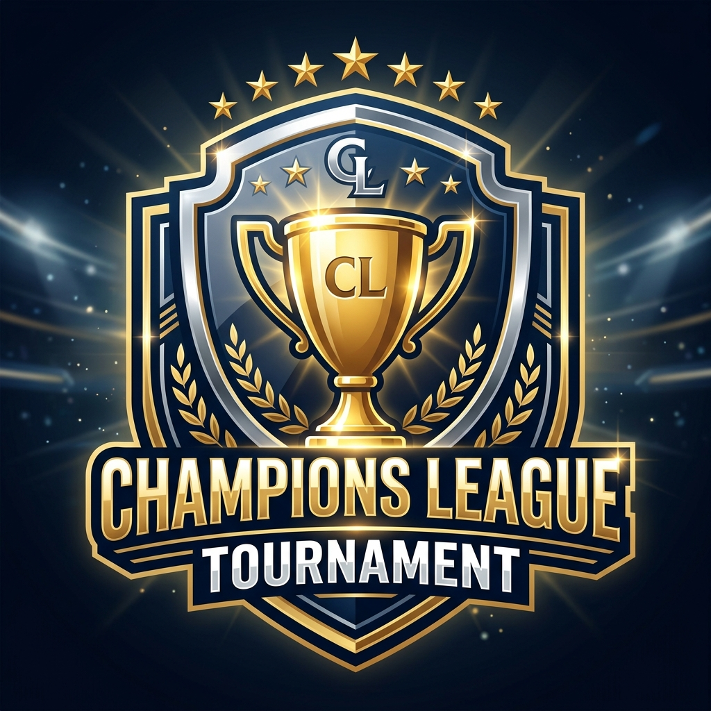

# Champions League Sports Tournament — Registration Web App

Official Registration Web Application for the **Champions League Sports Tournament 2026**. Designed for deployment on **Vercel** with full **Supabase Database & Storage** integration.



## 🌟 Key Features

- 🏆 **Champions League Aesthetic**: Custom dark-mode glassmorphism UI with Champions League logo header and gold/cyan glowing theme.
- 🐯 **Pug Tiger Mascot**: Official mascot graphic display on the right sidebar layout.
- ⚽ **8 Sports Combined Rating System**: Interactive skill sliders (1 to 10) across 8 disciplines:
  1. Pickleball
  2. Poker
  3. Cricket
  4. Triathlon
  5. Archery & Shooting
  6. Badminton
  7. Table Tennis
  8. Football / Multi-Sport
  - Live calculation of real-time **Combined Skill Index**.
- 👕 **Live 3D Jersey Customizer**: Real-time graphics rendering Jersey Name and Jersey Size badge.
- 📸 **Photo Compression & Upload**: Drag-and-drop avatar uploader with client-side canvas compression.
- 🛡️ **Organiser Admin Console (`/admin`)**: Registration list, player stats summary, search, status filter, and CSV data export.
- ⚡ **Supabase Ready**: Includes complete `schema.sql` database schema and RLS policies.

---

## 🚀 Setup & Vercel Deployment Guide

### Step 1: Connect Supabase Database
1. Create a project on [Supabase](https://supabase.com).
2. Go to **SQL Editor**, paste contents of `supabase/schema.sql` and run.
3. Copy **Project URL** and **Anon Key** from **Project Settings -> API**.
4. Update `js/config.js` with your credentials:
   ```javascript
   SUPABASE_URL: "https://your-project-id.supabase.co",
   SUPABASE_ANON_KEY: "your-anon-public-key-here"
   ```

### Step 2: Deploy to Vercel
1. Import this GitHub repository into your [Vercel Dashboard](https://vercel.com).
2. Framework Preset: **Other / Static HTML**.
3. Click **Deploy**.

---

## 📁 Repository Structure

```
.
├── index.html              # Main Registration Form & Mascot Layout
├── css/
│   └── style.css           # Design System & Responsive Theme
├── js/
│   ├── config.js           # Tournament & Backend Config
│   └── app.js              # Ratings Math, Jersey Preview & Supabase Submissions
├── assets/
│   ├── champions-logo.png  # Champions League Logo
│   ├── pug-tiger-mascot.png# Pug Tiger Mascot Graphic
│   └── sports-bg.png       # Stadium Background
├── admin/
│   ├── index.html          # Organiser Admin Console
│   └── admin.js            # Admin Data Management & CSV Export
├── supabase/
│   ├── schema.sql          # Full Supabase DB & Storage Policies
│   └── README.md           # Database Setup Instructions
├── vercel.json             # Vercel Route Config
└── README.md
```

---
*Built for Champions League Tournament 2026.*
